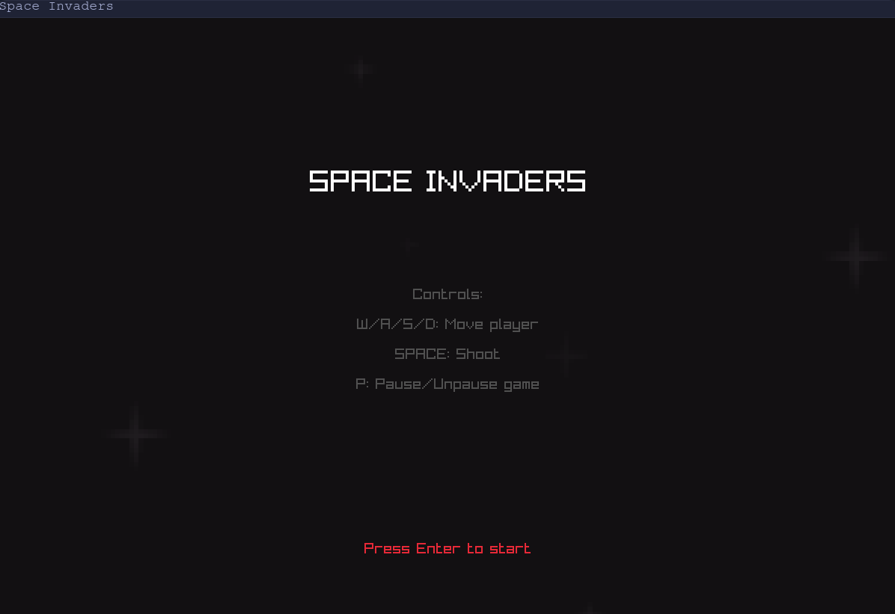
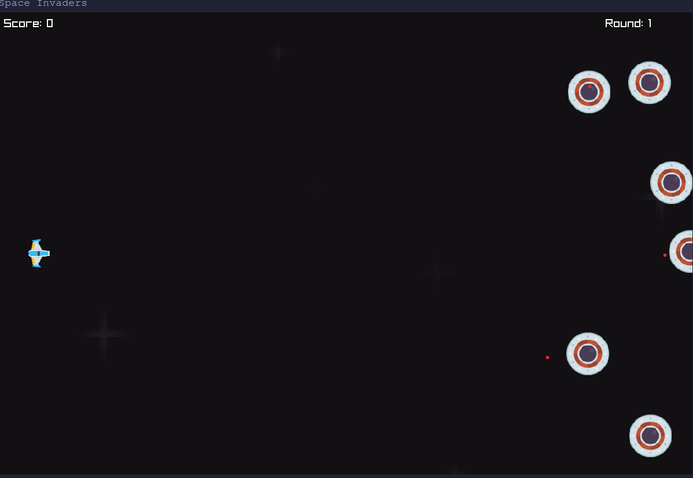

# CSpaceInvaders
Space Invaders implementation in C using Raylib, a simple and powerful library to handle graphics, input, and audio in games.

## Examples



## Features
- Classic Space Invaders gameplay.
- Player-controlled spaceship to shoot down enemy invaders.
- Increasing difficulty as you progress.
- Built using the Raylib library for fast and efficient game development.

## Requirements
To run this project, you need:
- A C compiler (e.g., GCC or Clang).
- The [Raylib library](https://www.raylib.com/).
- Make installed on your system.

## Installation
Clone the repository:
```bash
git clone https://github.com/your-repo/CSpaceInvaders.git
cd CSpaceInvaders
```

Compile the project:
```bash
make
```

Run the game:
```bash
./main
```